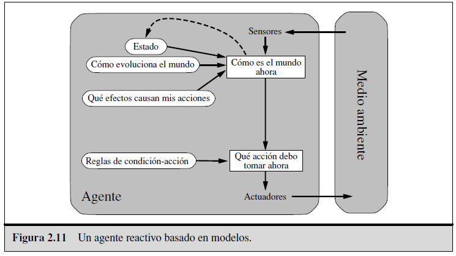

# Piedra-Papel-Tijera-IABD

## IES de Teis - Curso de especialización en Inteligencia Artificial y Big Data

### Información
Este proyecto esta hecho por el alumno: **Pablo Conde Soto**
Durante el proyecto me referiré al juego con el nombre de RPS (por sus siglas en inglés, Rock, Paper and Scissors)

---

### ¿En qué consiste el proyecto?
Este proyecto es una práctica del Curso de Especialización de Inteligencia Artificial y Big Data.
Consiste en la creación de un agente inteligente para jugar al juego: Piedra, papel y tijera.
El juego será CPU vs Humano.

---

### Especificación del entorno de trabajo
| Entorno de trabajo | Observable | Determinista | Episódico | Estático | Discreto | Conocido | Agentes |
:---: | :---: | :---: | :---: | :---: | :---: | :---: | :---: |
| RPS | Parcialmente observable | Estocástico | Secuencial | Estático | Discreto | Conocido | Multiagente competitivo |

#### Totalmente observable VS Parcialmente observable
Se trata de un entorno **parcialmente observable** dado que en el RPS ningún jugador puede saber que elección realizará su rival, por lo tanto no tienes acceso completo al estado del mundo antes de tomar una decisión.

#### Determinista VS Secuencial
Se trata de un entorno **estocástico** dado que el movimiento de tu rival no puede ser anticipado con certeza, por lo tanto el resultado de la partida depende de la acción tomada por cada jugador (computadora y humano).

#### Episódico VS Secuencial
Se trata de un entorno **secuencial** dado que en este proyecto, para desarrollar las estrategias de la computadora, se creará un historial de todas las partidas de cada jugador para que en base a esas estadísticas podamos desarrollar las mejores estrategias. Teniendo en cuenta esto, las rondas no son completamente independientes y las decisiones del jugador humano presente afectarán a las decisiones futuras de la computadora,por esta razón considero que el entorno de este proyecto será **secuencial**.

#### Estático VS Dinámico
Se trata de un entorno **estático** dado que en el RPS, en cada ronda, el estado del mundo no cambia hasta que ambos jugadores realizan una acción, además ambos jugadores podrían tomarse todo el tiempo que quieran para tomar su decisión y el estado del mundo no cambiaría.

#### Discreto vs Continuo
Se trata de un entorno **discreto** dado que ambos jugadores tienen un conjunto limitado y finito de acciones posibles (piedra, papel o tijera) y también tienen un número limitado de combinaciones posibles (tijera vs piedra, papel vs tijera, etc).

#### Conocido VS Desconocido
Se trata de un entorno **conocido** dado que ambos agentes conocen y entienden las reglas del juego y no necesitan aprender sobre el entorno.

#### Agente individual VS Multiagente
Se trata de un entorno de un sistema **multiagente competitivo** dado que hay dos agentes interactuando (la computadora y el jugador humano en este caso) y son éstos los cuales toman las decisiones que afectan directamente al resultado de cada ronda. Es de tipo claramente competitivo ya que los dos agentes compiten por ganar y no hay ningún tipo de cooperación en este juego.

---

## Identificación del tipo de agente y estructura

### Tipo de agente elegido: **Agente basado en modelos**

En este proyecto, el agente inteligente para jugar a **Piedra, Papel, Tijera, Lagarto, Spock (RPSLS)** se ha diseñado como un **agente basado en modelos**. Este tipo de agente utiliza un modelo interno del entorno para tomar decisiones informadas y adaptarse al comportamiento del jugador humano.

### Estructura del agente

La estructura del agente basado en modelos incluye los siguientes componentes clave:  

1. **Sensor**: Recoge las entradas del jugador humano, como su nombre y el movimiento elegido.  
   - **Función relevante**: `get_user_action()` para captar la acción del jugador.  

2. **Modelo del entorno**: Representa el historial de partidas jugadas contra el jugador humano. Esto permite al agente identificar patrones de comportamiento y tendencias en las elecciones del jugador.  
   - **Función relevante**: `cargar_historial()` para acceder al historial completo de partidas.  

3. **Estado interno**: Almacena información sobre las estadísticas y patrones detectados en el historial, como los movimientos más frecuentes o patrones específicos como secuencias repetidas.  
   - **Funciones relevantes**: `estrategia_basada_en_tendencias()` y `estrategia_combinada()` para analizar los movimientos históricos.  

4. **Tomador de decisiones**: Decide el próximo movimiento de la computadora en base al estado interno, el modelo del entorno y las reglas del juego.  
   - **Función relevante**: `get_computer_action(nombre_jugador)` que selecciona la estrategia adecuada y decide el próximo movimiento.  

5. **Actuador**: Ejecuta la acción elegida por la computadora (Piedra, Papel, Tijera, Lagarto o Spock) y la comunica al jugador humano.   

### Justificación de los componentes

1. **Sensor y Modelo del Entorno**  
   La función `get_user_action()` actúa como sensor al captar directamente las acciones del jugador humano. Por otro lado, `cargar_historial()` permite al agente mantener un modelo interno del entorno basado en el historial de partidas. Este modelo es esencial para anticipar y contrarrestar los movimientos del jugador humano, que es el objetivo principal del proyecto.  

2. **Estado interno y Tomador de decisiones**  
   Los patrones y tendencias detectados por `estrategia_basada_en_tendencias()` y `estrategia_combinada()` forman el estado interno del agente. Este estado se utiliza como base para tomar decisiones informadas en `get_computer_action(nombre_jugador)`. De esta manera, el agente no solo reacciona, sino que también aprende y se adapta al comportamiento del jugador, aumentando sus posibilidades de ganar.  

3. **Actuador**  
   El actuador en este proyecto se reduce a comunicar la acción de la computadora, lo cual es suficiente para un juego como RPSLS, ya que no hay interacción física directa.  

Este diseño permite al agente simular un comportamiento estratégico e inteligente, alineándose con los principios de un agente basado en modelos tal y como se describen en el capítulo 2 de *Inteligencia Artificial: Un Enfoque Moderno*.  

### Imagen de la estructura del agente

### Fuentes
Russell, Peter. _ARTIFICIAL INTELLIGENCE : A Modern Approach_, Global Edition. S.L., Pearson Education Limited, 2021.
Chat GPT --> Me he apoyado en él para: solucionar algunos errores al programar las estrategias y el historial, para obtener el movimiento que contraataca a otro con una fórmula matemática y para obtener el movimiento más frecuente con un contador.